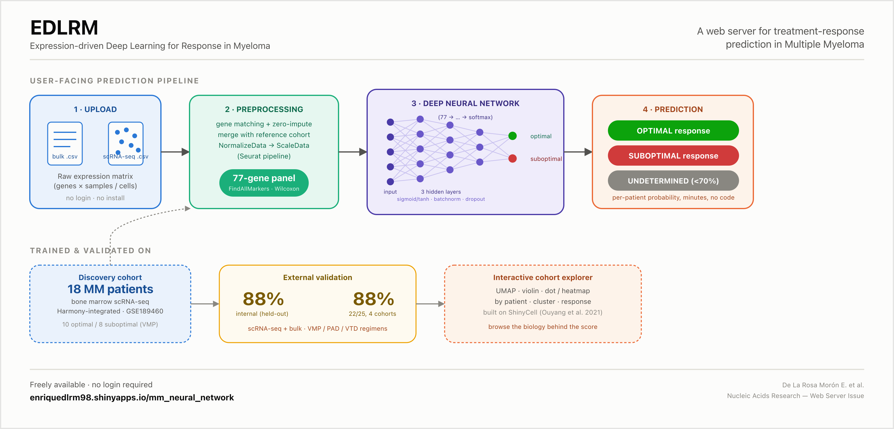
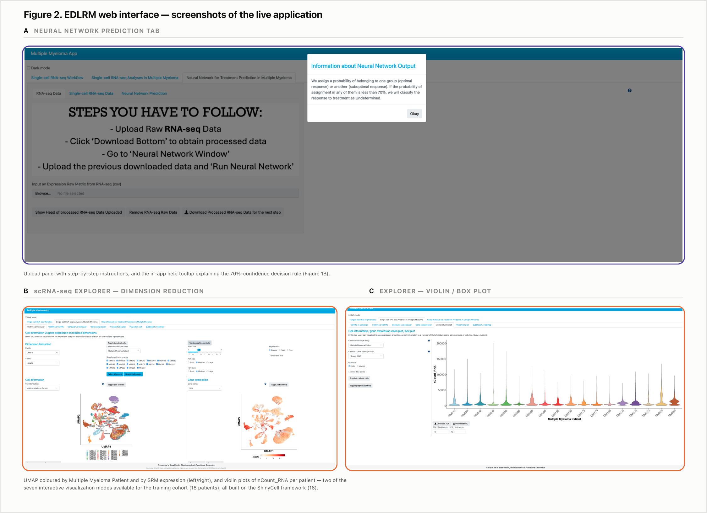
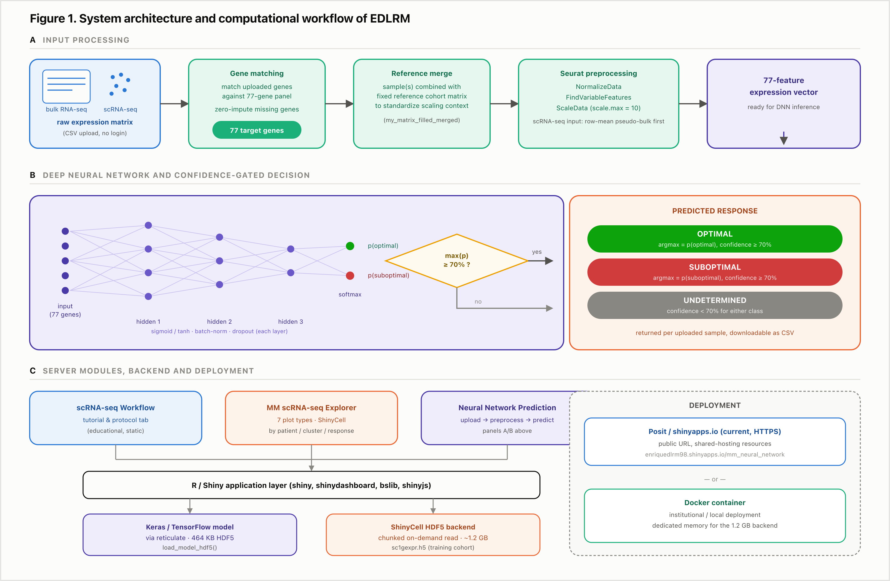

<div align="center">

# EDLRM

### Expression-driven Deep Learning for Response in Myeloma

**A web server for deep-learning-based prediction of first-line treatment response in
Multiple Myeloma, from single-cell and bulk transcriptomic data.**

[](LICENSE)
[](https://www.r-project.org/)
[](https://shiny.posit.co/)
[](https://enriquedlrm98.shinyapps.io/EDLRM/)
[](#citation)

[**🔗 Live demo**](https://enriquedlrm98.shinyapps.io/EDLRM/) ·
[Features](#features) ·
[Getting started](#getting-started) ·
[Data](#data) ·
[Citation](#citation)

</div>

<br>

<p align="center">
  
</p>

## About

Current response-assessment criteria in **Multiple Myeloma (MM)** rely entirely on
*post-treatment* measurements (serum/urine M-protein, bone marrow examination) — there
is no molecular test used at diagnosis to anticipate which patients will respond
suboptimally to first-line therapy.

**EDLRM** operationalizes a deep neural network (DNN) trained on single-cell RNA-seq
(scRNA-seq) profiles from bone marrow of MM patients, identifying a **77-gene
signature** that discriminates optimal from suboptimal responders to bortezomib-based
regimens (VMP, PAD, VTD). The underlying model was validated internally (88% accuracy,
held-out split) and externally across **4 independent cohorts** spanning single-cell
and bulk RNA-seq data (88% accuracy, 22/25 patients).

This repository hosts the **Shiny web application** that makes that model usable by
anyone, without installing anything or writing a single line of code:

1. **Upload** a raw bulk or single-cell expression matrix (CSV).
2. EDLRM **preprocesses** it (gene matching, imputation, Seurat normalization/scaling)
   into the exact numerical space the network was trained on.
3. The **DNN returns a per-sample prediction** — optimal / suboptimal / undetermined
   (confidence-gated at 70%) — in minutes, with a downloadable results table.

It also embeds a full **interactive explorer** (built on
[ShinyCell](https://github.com/SGDDNB/ShinyCell)) of the training scRNA-seq cohort
itself, so the biology behind every prediction can be inspected directly.

> 📄 This tool accompanies a series of studies on single-cell transcriptomics and
> machine/deep learning in hematological malignancies — see [Citation](#citation).

## Features

| Tab | What it does |
|---|---|
| 🧬 **scRNA-seq Workflow** | Educational walkthrough of the single-cell RNA-seq experimental and analytical pipeline (sample isolation → sequencing → Seurat analysis), with an embedded protocol notebook. |
| 🔎 **Single-cell RNA-seq Analyses in Multiple Myeloma** | Interactive exploration of the training cohort (18 MM patients) across **7 visualization modes** — reduced-dimension embeddings, cell-info × cell-info, gene × gene, co-expression, violin/box, proportion, and bubble/heatmap plots — all filterable by patient, Seurat cluster, or treatment-response group. |
| 🧠 **Neural Network Prediction** | Upload a raw bulk or single-cell expression matrix and get a treatment-response prediction from the validated 77-gene DNN classifier. |

## Screenshots

<p align="center">
  
</p>

## Architecture

<p align="center">
  
</p>

EDLRM is an R/Shiny application. Model inference uses `keras`/`tensorflow` (via
`reticulate`) to load a lightweight (464 KB) trained network; the interactive explorer
is backed by a chunked HDF5 store for memory-efficient, on-demand querying of the
training cohort's full expression matrix. See [`app.R`](app.R) for the complete
implementation.

## Getting started

### 🌐 Just use it — no install needed

**[→ enriquedlrm98.shinyapps.io/EDLRM](https://enriquedlrm98.shinyapps.io/EDLRM/)**

### 💻 Run it locally

```bash
git clone https://github.com/Enriquedlrm16/EDLRM.git
cd EDLRM
Rscript install.R                          # installs R package dependencies
Rscript -e 'keras::install_keras()'        # first-time only: Python/TensorFlow backend
```

Then, from R:

```r
shiny::runApp(".")
```

> ⚠️ **Before running locally**, read [Large reference dataset](#large-reference-dataset)
> below — the interactive explorer tab needs a ~1.2 GB file that is not stored in this
> repository. The **Neural Network Prediction** tab works without it.

### 🐳 Run it with Docker

```bash
docker build -t edlrm .
docker run -p 3838:3838 edlrm
# then open http://localhost:3838
```

See [`Dockerfile`](Dockerfile) for details, including how to mount the large reference
dataset for the explorer tab.

## Data

### Training / validation cohorts

| Dataset | Role | Accession |
|---|---|---|
| Bone marrow scRNA-seq, 18 MM patients (VMP-treated) | Training / discovery of the 77-gene signature | [GSE189460](https://www.ncbi.nlm.nih.gov/geo/query/acc.cgi?acc=GSE189460) |
| scRNA-seq, relapsed/refractory MM | External validation | [GSE161801](https://www.ncbi.nlm.nih.gov/geo/query/acc.cgi?acc=GSE161801) |
| Bulk RNA-seq, PAD regimen (PADIMAC study) | External validation | [GSE116324](https://www.ncbi.nlm.nih.gov/geo/query/acc.cgi?acc=GSE116324) |
| Bulk RNA-seq, PAD regimen | External validation | [GSE159426](https://www.ncbi.nlm.nih.gov/geo/query/acc.cgi?acc=GSE159426) |

Full methodological details are in the associated manuscript (see
[Citation](#citation)).

### Large reference dataset

The interactive explorer tab reads the training cohort's full single-cell expression
matrix from `sc1gexpr.h5` (~1.2 GB), generated with
[ShinyCell](https://github.com/SGDDNB/ShinyCell). This file is **intentionally not
tracked in this repository** (GitHub is not an appropriate host for a file this size).

- To just **use the app**, the [live demo](https://enriquedlrm98.shinyapps.io/EDLRM/)
  already includes it — no download needed.
- To **run the explorer tab locally**, a persistent, versioned copy will be deposited
  in a data repository (Zenodo/GigaDB) with its own DOI — *link to be added here once
  published*. Place the downloaded file in the repository root before launching the app.
- The **Neural Network Prediction** tab does **not** require this file and works fully
  offline / locally as-is.

## Repository structure

```
EDLRM/
├── app.R                          # Shiny application (UI + server)
├── install.R                      # R dependency installation script
├── Dockerfile                     # Reproducible deployment image
├── genes_neural.csv               # 77-gene signature panel
├── my_matrix_filled_merged.csv    # Reference cohort matrix (scaling context)
├── my_model_MM_prueba_2_all.h5    # Trained Keras/TensorFlow DNN (464 KB)
├── sc1conf.rds, sc1def.rds,       # ShinyCell configuration objects
│   sc1gene.rds, sc1meta.rds         (explorer tab)
├── sc1gexpr.h5                    # ⚠️ NOT in repo — see "Large reference dataset"
├── www/                           # Static assets (protocol figures, tutorial HTML)
└── figures/                       # Graphical abstract & manuscript figures
```

## Citation

If you use EDLRM in your research, please cite:

> De La Rosa Morón E, Berral-González A, Sánchez-Santos JM, De Las Rivas J. **EDLRM: a
> web server for deep-learning-based prediction of first-line treatment response in
> multiple myeloma from single-cell and bulk transcriptomic data.** *Manuscript in
> preparation.*

This tool builds directly on:

> De La Rosa Morón E, et al. **Modelling Therapeutic Response with AI in Multiple
> Myeloma Using Single-Cell Data.** *Manuscript in preparation.*

> Rosa EDL, Alonso-Moreda N, Berral-González A, Sánchez-Luis E, González-Velasco O,
> Sánchez-Santos JM, De Las Rivas J. **Novel Assignment of Gene Markers to
> Hematological and Immune Cells Based on Single-Cell Transcriptomics.**
> *Int J Mol Sci.* 2025;26(2):805.
> [doi:10.3390/ijms26020805](https://doi.org/10.3390/ijms26020805)

The interactive explorer is built on **ShinyCell**:

> Ouyang JF, Kamaraj US, Cao EY, Rackham OJL. **ShinyCell: simple and sharable
> visualisation of single-cell gene expression data.** *Bioinformatics.*
> 2021;37(19):3374–3376. [doi:10.1093/bioinformatics/btab209](https://doi.org/10.1093/bioinformatics/btab209)

## Authors

Developed in the **Bioinformatics and Functional Genomics** group at the
[Cancer Research Center (CiC-IBMCC, CSIC/USAL/IBSAL)](https://www.cicancer.org/),
University of Salamanca.

- **Enrique De La Rosa Morón** — [enriquedlrm98@usal.es](mailto:enriquedlrm98@usal.es)
- Alberto Berral-González
- José Manuel Sánchez-Santos
- Javier De Las Rivas (PI) — [jrivas@usal.es](mailto:jrivas@usal.es)

## License

Released under the [MIT License](LICENSE).

## Acknowledgments

Funded by the Instituto de Salud Carlos III (ISCiii, PI22/00877; IMPaCT-Data
IMP/00019, co-financed by FEDER), the Junta de Castilla y León / Fondo Social Europeo,
and a Fulbright Senior Scholar grant (PRX23/00628).
